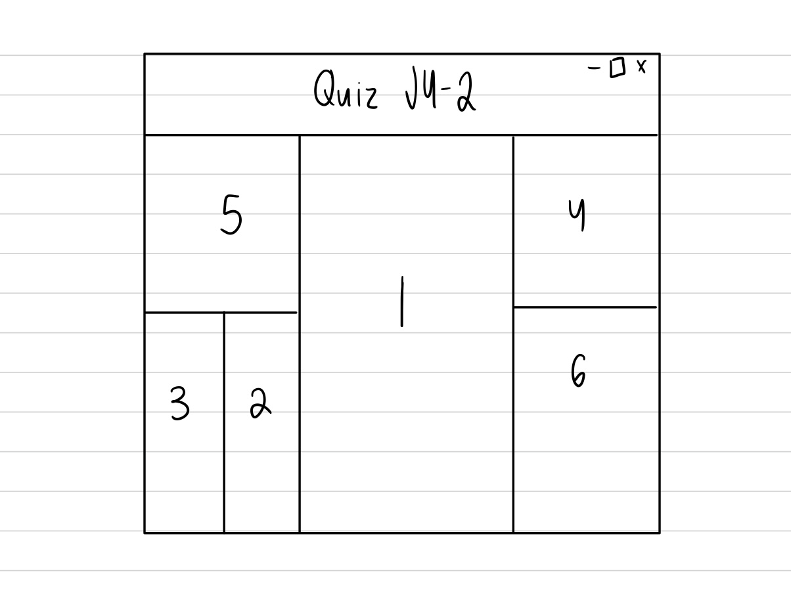

## 1. How does object-oriented programming pair so closely with GUIs?
Object oriented programming pairs closely with GUIs because both OOP and GUIs work on allowing for easier interpreation and application of more complicated things. GUIs use things like buttons, windows, etc to allow for the "average user" to interact with computer applications easier, similar to how OOP uses interfaces and objects to make code easier to interpret and digest. 

## 2. What is the relationship between WindowListener and WindowAdapter?
WindowAdapter is an example of multithreading where when the final window is closed, main is also closed. WindowListener performs the same actions as WindowAdapter, but here, even when main has closed, the program persists. 

## 3. What does the program below produce for a GUI? (You can sketch and upload an image or describe it – do this without running the program to make sure you understand what each line below is doing).


## 4. Modify the HelloGoodbyeEx2 code to update the number of times the button has been clicked on the button’s label itself. 
```
import javax.swing.*;
import java.awt.*;
import java.awt.event.*;

public class HelloGoodbyeEx2 {

    public static void main(String args[]) {
        JFrame f = new JFrame();
        f.setTitle("Hello/Goodbye Ex1");
        f.setDefaultCloseOperation(JFrame.EXIT_ON_CLOSE);
        
        JLabel label = new JLabel("Hello ");
        JButton button = new JButton("Click me!");
        //using an anonymous (static) class
        //avoids having to make ButtonClickListenerEx1 class above
        button.addActionListener(new ActionListener() {
                //implement the one method here
                //shares the name space with the whole class
                //has access to the label field above
                int count = 0;
                public void actionPerformed(ActionEvent e) {
                    count++;
                    if (label.getText().equals("Hello")) {
                        label.setText("Goodbye " + count);
                    }else {
                        label.setText("Hello" + count);
                    }
                }
            });
        
        f.add(button, BorderLayout.SOUTH);
        f.add(label, BorderLayout.NORTH);

        f.pack();
        f.setVisible(true);
        
    }
}

```


## 5. Consider the following Java swing GUI
```
public class RedPillBluePill extends JFrame {
    JLabel label;

    public RedPillBluePill() {
        this.setSize(300, 300);
        this.setDefaultCloseOperation(JFrame.EXIT_ON_CLOSE);

        JPanel panel = new JPanel(new BorderLayout());        
        JButton red = new JButton("red");
        JButton blue = new JButton("blue");
        panel.add(red, BorderLayout.EAST);
        panel.add(blue, BorderLayout.WEST);
        label = new JLabel("click a button");
        this.add(label, BorderLayout.NORTH);
        this.add(panel, BorderLayout.SOUTH);

        red.addActionListener(new ActionListener() {
            @Override
            public void actionPerformed(ActionEvent e) {
                // TODO Auto-generated method stub
                label.setText("RED");        
            }
        });

        blue.addActionListener(new ActionListener() {

            @Override
            public void actionPerformed(ActionEvent (e) -> {
                    if (l.getText().equals("Hello")) {
                        l.setText("Goodbye");
                    }else {
                        l.setText("Hello");
                    }
                });
    }
}
```
Convert the ActionListeners to Lambda Functions.

```
red.addActionListener((e) -> {label.setText("RED");});
blue.addActionListener((e) -> {label.setText("BLUE");});
```

## 6. Explain why for ActionListener you can use a Lambda function but for WindowListener you cannot?
The Lambda expressions only work if there is a single method to implement it. 


## 7. Write a program that allows you to enter a 6-digit PIN, like you would on your smartphone to unlock it. It should have the following layout:

```
 [ DISPLAY PIN AS TYPED ]

   [ 1 ]  [ 2 ] [ 3 ] 
   
   [ 4 ]  [ 5 ] [ 6 ]    
   
   [ 7 ]  [ 8 ] [ 9 ]       

   [ < ]  [ 0 ]
```

Where ```[ < ]``` is a “backspace” button. The display should show the PIN as it is typed, and when the user enters the PIN 202113, the display changes to “YOU MAY ENTER!”

```Java
import javax.swing.*;
import java.awt.*;
import java.awt.event.*;

public class Password extends JFrame{
    private JTextField input;
    private String pin = "";

    public Password(){
        Frame frame = new JFrame();
        JPanel top= new JPanel();
        JPanel bottom = new JPanel();
        top.setLayout(new BorderLayout());
        bottom.setLayout(new GridLayout());

        JButton b1 = new JButton("1");
        
        JButton b2 = new JButton("2");

        JButton b3 = new JButton("3");

        JButton b4 = new JButton("4");

        JButton b5 = new JButton("5");

        JButton b6 = new JButton("6");

        JButton b7 = new JButton("7");

        JButton b8 = new JButton("8");

        JButton b9 = new JButton("9");

        JButton bbackspace = new JButton("<");

        JButton b0 = new JButton("0");


        input = new JTextField();
        input.setEditable(false);
        top.add(input, BorderLayout.NORTH);
        bottom.setLayout(new GridLayout(4,3));


        bottom.add(b1);
        
        bottom.add(b2);

        bottom.add(b3);

        bottom.add(b4);

        bottom.add(b5);

        bottom.add(b6);

        bottom.add(b7);

        bottom.add(b8);

        bottom.add(b9);

        bottom.add(bbackspace);
        
        bottom.add(b0);


        listenerhelper(b1);
       
        listenerhelper(b2);

        listenerhelper(b3);

        listenerhelper(b4);

        listenerhelper(b5);

        listenerhelper(b6);

        listenerhelper(b7);

        listenerhelper(b8);

        listenerhelper(b9);

        listenerhelper(b0);


        bbackspace.addActionListener(new ActionListener() {
            public void actionPerformed(ActionEvent e) {
                if (pin.length() > 0) {
                    pin = pin.substring(0, pin.length - 1);
                    input.setText(pin);
                }
            }
        });

        frame.add(top, BorderLayout.NORTH);
        frame.add(bottom, BorderLayout.SOUTH);
        frame.pack();
        frame.setTitle("Unlock Phone: ");
        frame.setLocation(100,100);
        frame.setVisible(true);
    }

    public void listenerhelper(JButton button){
        button.addActionListener(new ActionListener() {
            public void actionPerformed(ActionEvent e){
                if(pin.length() < 6) {
                    pin += button.getText();
                    input.setText(pin);
                }
                if(pin.equals("202113")) {//correct pin!
                    input.setText("YOU MAY ENTER!");
                }
                else if(pin.length() == 6){
                    input.setText("WRONG PIN!!!");
                }
            }
        });
    }


        public static void main(String args[]){
            Password p = new Password();
            p.setVisible(true);
        }


    }

```

